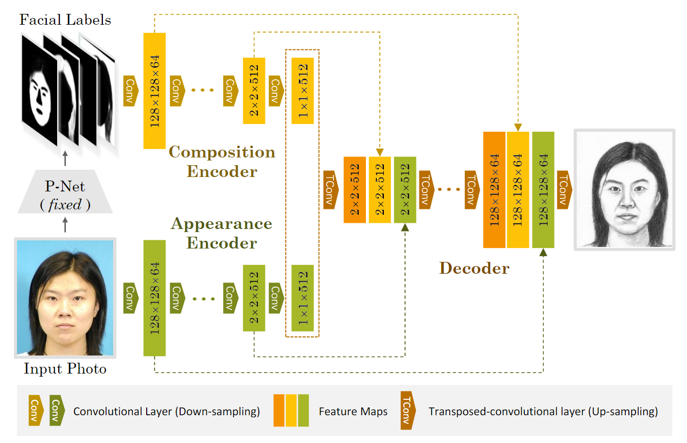

# CA-GAN
We provide PyTorch implementation for our CYB paper "Towards Realistic Face Photo-Sketch Synthesis via Composition-Aided GANs"

[[paper]]()
## Our Proposed Framework


## Sample Result
**left:** sketch synthesis; **right:** photo synthesis


> (a)Input Image, (b)cGAN, (c)CA-GAN, (d)SCA-GAN

## Citation
If you find this useful for your research, please use the following.
```
@article{gao2017ca-gan,
	title = {Towards Realistic Face Photo-Sketch Synthesis via Composition-Aided GANs},
	author = {Jun Yu, Xingxin Xu, Fei Gao, Shengjie Shi, Meng Wang, Dacheng Tao, and Qingming Huang},
	booktitle = {arXiv:1712.00899},
	year = {2019},
}
```

## Prerequisites
- Linux or similar environment
- Python 2.7
- NVIDIA GPU + CUDA CuDNN

## Getting Started
### Installation
- Clone this repo:
    ```shell script
    git clone https://github.com/jehovahxu/ca-gan
    cd ca-gan
    ```
- Install PyTorch 0.4+ and torchvision from http://pytorch.org and other dependencies (e.g., visdom and dominate). You can install all the dependencies by
    ```shell script
    pip install -r requirments.txt
    ```
 
### ca-gan train/test
- Download a dataset([CUFS](http://mmlab.ie.cuhk.edu.hk/archive/facesketch.html) split train and test with this [files]())
- Download the [VGG-Face](http://www.robots.ox.ac.uk/~vgg/software/vgg_face/) model which based on the VGG-Very-Deep-16 CNN architecture.
 Here we convert torch weight to pyTorch to fit our frame, you can download our converted model directly.
    - [Google Drive](https://drive.google.com/open?id=1V2dfOLXSgAS9V8PvhTeQAP6KGI40aff_)
    - [Baidu Drive]()
- Get face parsing
    - here we use [face-parsing.PyTorch](https://github.com/jehovahxu/face-parsing.PyTorch) to get face parsing
    - Check out the [branch](https://github.com/jehovahxu/ca-gan) to get the our previous used 
- Train a model
    ```shell script
    python main.py --model_vgg {model path}
    ```
- Test the model
    ```shell script
    python test.py --dataroot {data path} --fold {epoch number}
    ```
    - The option `fold` is used for load `./checkpoint/netG_epoch_'+fold+'.weight` and you can edit it in `test.py` 
### Apply a pre-trained model
- You can download a pre-trained model which trained on the CUSF and can transform photo to sketch  :
    - [Google Drive](https://drive.google.com/open?id=17KG1e0-cq_dmidQovzG9vOWZSq3of0Lx)
    - [Baidu Drive]()
-  The pre-trained model need to be save at `./checkpoint` and named it as `netG_epoch_'+fold+'.weight`
- Then you can test the model

### Datasets
- [CUFS](http://mmlab.ie.cuhk.edu.hk/archive/facesketch.html)
- [CUFSF](http://mmlab.ie.cuhk.edu.hk/archive/cufsf/)

### Result
- Our final result with new parsing can be downloaded:
    - [Google Drive](https://drive.google.com/open?id=1cie6l-IuxSm-ste2bIi6L7Y_leWNpotB)
    - [Baidu Drive]()


### Training/Test Tips
Best practice for training and testing your models.<p>
Feel free to ask any questions.Xingxin Xu, [jehovahxu@gmail.com](jehovahxu@gmail.com)<p>
### Acknowledgments
Our code is inspired by [pytorch-CycleGAN-and-pix2pix](https://github.com/junyanz/pytorch-CycleGAN-and-pix2pix)


